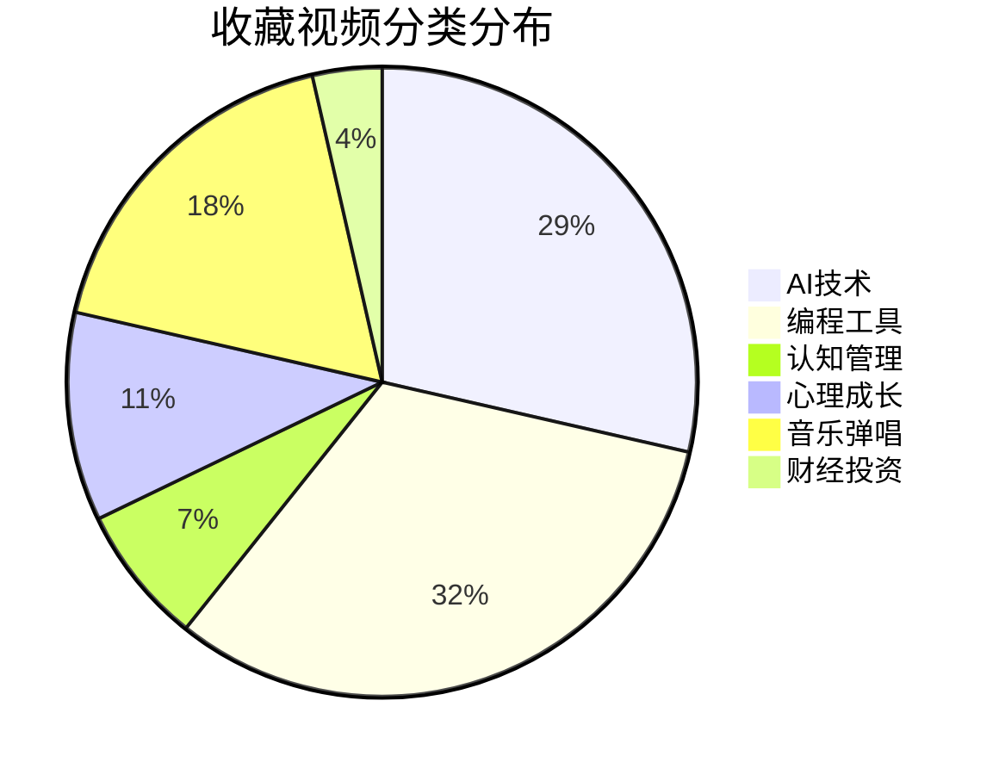

# 📚 抖音收藏视频总览

> [!summary] 概览
> 共收藏 **28** 个视频，分为 **6 大分类**。本文档为所有收藏视频的导航入口。

---

## 🤖 [[01-AI技术 - 导航页|01-AI技术]]（8个）

| # | 视频 | 标签 |
|---|------|------|
| 1 | [[AI大模型发展趋势与人工智能未来]] | #人工智能 #AI大模型 |
| 2 | [[MCP协议深度解析]] | #MCP #AI协议 |
| 3 | [[AI Agent智能体核心概念解析]] | #AI_Agent #智能体 |
| 4 | [[国产大模型最新进展]] | #大模型 #人工智能 |
| 5 | [[提升豆包大模型能力的小技巧]] | #AI #豆包 |
| 6 | [[AI工具精选推荐]] | #AI #抖音精选 |
| 7 | [[Hermes Agent记忆系统]] | #Hermes #AI记忆 |
| 8 | [[AI Agent记忆架构]] | #AI记忆 #Agent |

## 💻 [[02-编程工具 - 导航页|02-编程工具]]（9个）

| # | 视频 | 标签 |
|---|------|------|
| 1 | [[原生支持DeepSeek的Claude Code]] | #Claude_Code #DeepSeek |
| 2 | [[AI代码生成实战]] | #AI编程 #代码生成 |
| 3 | [[零基础用AI写代码入门]] | #零基础 #AI写代码 |
| 4 | [[GitHub优质开源项目推荐]] | #GitHub #优质项目 |
| 5 | [[Claude AI编程工具详解]] | #AI #Claude |
| 6 | [[Vibe Coding - AI编程新范式]] | #Vibe_Coding #AI编程 |
| 7 | [[Claude Code必装3个开源工具]] | #Claude_Code #Anthropic |
| 8 | [[LLM项目GitHub排行榜]] | #LLM #GitHub排行榜 |
| 9 | [[Claude Code程序员实战指南]] | #Claude_Code #程序员 |

## 🧠 [[03-认知管理 - 导航页|03-认知管理]]（2个）

| # | 视频 | 标签 |
|---|------|------|
| 1 | [[AI时代管理者核心能力]] | #职场 #领导力 |
| 2 | [[表达能力提升方法论]] | #表达力 #沟通 |

## 🌱 [[04-心理成长 - 导航页|04-心理成长]]（3个）

| # | 视频 | 标签 |
|---|------|------|
| 1 | [[高敏感人群的生存指南]] | #高敏感 #父母课堂 |
| 2 | [[人间共鸣 - 生活感悟]] | #人间共鸣 #生活感悟 |
| 3 | [[高敏感人群与讨好型人格自救]] | #高敏感人群 #道德经 |

## 🎵 [[05-音乐弹唱 - 导航页|05-音乐弹唱]]（5个）

| # | 视频 | 标签 |
|---|------|------|
| 1 | [[我是湘里别 - GAI周延]] | #GAI #C-Block |
| 2 | [[关山酒 - 一笑江湖翻唱]] | #关山酒 #一笑江湖 |
| 3 | [[光遇游戏音乐]] | #光遇 #游戏音乐 |
| 4 | [[不再犹豫 - 致敬Beyond经典]] | #不再犹豫 #Beyond |
| 5 | [[合拍音乐创作]] | #合拍 #音乐创作 |

## 💰 [[06-财经投资 - 导航页|06-财经投资]]（1个）

| # | 视频 | 标签 |
|---|------|------|
| 1 | [[财经投资干货分享]] | #财经 #投资 |

---

## 📊 收藏画像分析

### 🎯 核心关注领域

1. **AI + 编程工具（17个，占61%）** — 这是你收藏的绝对主力，聚焦于 AI Agent、Claude Code、大模型应用、编程自动化
2. **音乐弹唱（5个，18%）** — 涵盖说唱、翻唱、经典致敬，音乐是工作外的解压方式
3. **心理成长 + 认知管理（5个，18%）** — 关注高敏感人格、表达力、领导力提升
4. **财经投资（1个，4%）** — 少量关注，与量化交易主业形成互补

### 🔗 主题关联图谱

- `AI Agent` → [[AI Agent智能体核心概念解析]] ↔ [[Hermes Agent记忆系统]] ↔ [[AI Agent记忆架构]]
- `Claude Code` → [[原生支持DeepSeek的Claude Code]] ↔ [[Claude Code必装3个开源工具]] ↔ [[Claude Code程序员实战指南]] ↔ [[Claude AI编程工具详解]]
- `高敏感人格` → [[高敏感人群的生存指南]] ↔ [[高敏感人群与讨好型人格自救]]
- `大模型` → [[AI大模型发展趋势与人工智能未来]] ↔ [[国产大模型最新进展]] ↔ [[提升豆包大模型能力的小技巧]]

---

> [!tip] 使用建议
> - 每个视频笔记中都有 `💡 个人思考` 区域，观看后记得补充笔记
> - 通过 `🔗 相关笔记` 的双向链接探索关联内容
> - 在 Obsidian 的 **图谱视图** 中可以可视化所有笔记的关联关系
